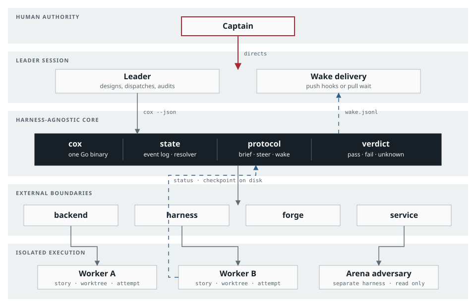
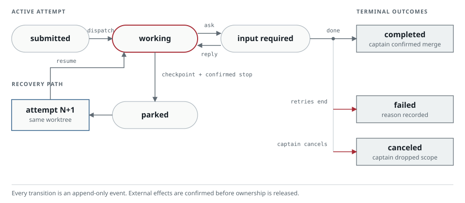
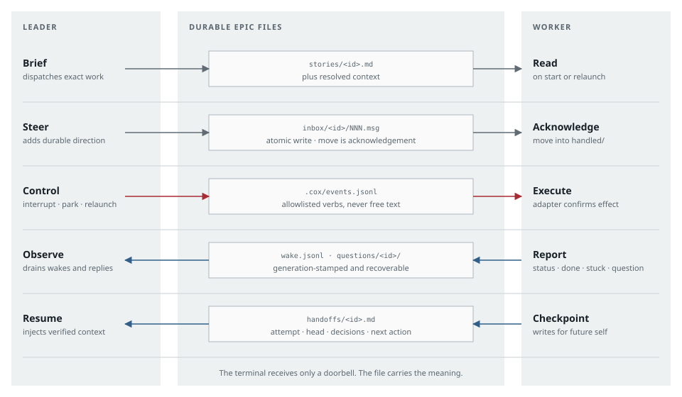

---
hide:
  - toc
---

  <section class="cox-home__hero" aria-labelledby="cox-home-title">
    
    

      
Multi-agent epic orchestration

      <h1 id="cox-home-title">Orchestrate epics. Not chats.</h1>
      
Coxswain gives one leader durable state, isolated workers, and explicit authority across every repository.

      

        <a class="cox-button cox-button--primary" href="getting-started/install/">Install cox</a>
        <a class="cox-button cox-button--secondary" href="#why">See the model</a>
      

    

    <figure class="cox-diagram">
      

        <picture>
          <source media="(max-width: 719px)" srcset="assets/diagrams/orchestration-map-mobile.svg">
          
        </picture>
      

      <figcaption>Solid lines call a boundary. Blue dashed lines return durable status, checkpoints, and wakes through files. <a href="assets/diagrams/orchestration-map.svg">Open full size</a></figcaption>
      

        
Read the topology as text

        
The captain directs one leader session. The leader calls the harness-agnostic cox core. Cox reaches backend, harness, forge, and service boundaries through adapters, then coordinates one isolated worker per story and worktree. Workers return status and checkpoints through durable files, and the wake queue brings relevant change back to the leader.

      

    </figure>
  </section>

  <section class="cox-home__why" id="why" aria-labelledby="why-title">
    <h2 id="why-title">Work survives the session.</h2>
    
A compacted prompt or restarted terminal does not erase the operational record.

    

      <article class="cox-principle">
        

          <h3>State is a file</h3>
          
Briefs, events, steering, and checkpoints remain inspectable on disk.

        

      </article>
      <article class="cox-principle">
        

          <h3>Current state is derived</h3>
          
An append-only event log replaces guesses from conversation history.

        

      </article>
      <article class="cox-principle">
        

          <h3>Boundaries are adapters</h3>
          
The core stays independent from backends, harnesses, forges, and services.

        

      </article>
      <article class="cox-principle">
        

          <h3>Authority stays human</h3>
          
Only the captain signs the design, merges changes, and closes the epic.

        

      </article>
    

  </section>

  <section class="cox-home__lifecycle" aria-labelledby="lifecycle-title">
    

      <h2 id="lifecycle-title">Every story has a visible state.</h2>
      
Transitions are events with an actor, an attempt, and evidence. Unknown never silently becomes clean.

    

    <figure class="cox-diagram">
      

        <picture>
          <source media="(max-width: 719px)" srcset="assets/diagrams/story-lifecycle-mobile.svg">
          
        </picture>
      

      <figcaption>A parked story resumes as a new attempt in the same worktree. Terminal outcomes retain their evidence. <a href="assets/diagrams/story-lifecycle.svg">Open full size</a></figcaption>
      

        
Read the lifecycle as text

        
Dispatch moves a submitted story to working. A worker can request input and continue after a reply. Parking requires a current checkpoint and a confirmed stop, then resume creates attempt N+1 in the same worktree. Completion requires captain-confirmed merge evidence. Failure and cancellation require a recorded reason.

      

    </figure>
  </section>

  <section class="cox-home__handoff" aria-labelledby="handoff-title">
    

      <h2 id="handoff-title">Five lanes. One job each.</h2>
      
The terminal gets a doorbell. The durable file carries the meaning, acknowledgement, and recovery context.

    

    <figure class="cox-diagram">
      

        <picture>
          <source media="(max-width: 719px)" srcset="assets/diagrams/handoff-channels-mobile.svg">
          
        </picture>
      

      <figcaption>Gray moves work forward. Red invokes control. Blue returns status, questions, and checkpoint context. <a href="assets/diagrams/handoff-channels.svg">Open full size</a></figcaption>
      

        
Read the handoff as text

        
The leader dispatches a verbatim brief, adds direction through an atomic inbox record, and controls the worker only with allowlisted verbs. The worker reports status or questions into the epic and writes a checkpoint for its future session. Coxswain owns every handoff record while the backend provides only a worktree and terminal.

      

    </figure>
  </section>

  <section class="cox-home__arena" aria-labelledby="arena-title">
    

      <h2 id="arena-title">Design review that can block.</h2>
      
Arena makes a separate harness challenge the design before workers inherit its mistakes.

    

    <ol class="cox-arena__steps">
      <li>01
<h3>Challenge</h3>
An adversary receives the same blinded context pack.

</li>
      <li>02
<h3>Verify</h3>
Claims need machine-checked file, line, and revision evidence.

</li>
      <li>03
<h3>Synthesize</h3>
The leader resolves contradictions and amends the design.

</li>
      <li>04
<h3>Sign</h3>
The captain accepts the contract before dispatch begins.

</li>
    </ol>
  </section>

  <section class="cox-home__start" id="start-here" aria-labelledby="start-title">
    

      <h2 id="start-title">Run your first epic.</h2>
      
Install the binary and plugin, verify the workspace, then follow the narrow first-epic route.

      

        <code>cox workspace init --root ~/Work/my-workspace --repo app=/path/to/repo
cox epic new my-project my-first-epic --repo app --root ~/Work/my-workspace
cox epic stories --epic ~/Work/my-workspace/my-project/epics/my-first-epic</code>
      

    

    <nav class="cox-paths" aria-label="Start paths">
      <a class="cox-path" href="getting-started/install/"><strong>Install</strong><small>Orca, binary, harness, doctor</small></a>
      <a class="cox-path" href="getting-started/workspace/"><strong>Create a workspace</strong><small>One command, both shapes</small></a>
      <a class="cox-path" href="getting-started/first-epic/"><strong>First epic</strong><small>New, stories, dispatch</small></a>
      <a class="cox-path" href="getting-started/concepts/"><strong>Core concepts</strong><small>Captain, leader, worker, story</small></a>
    </nav>
  </section>

